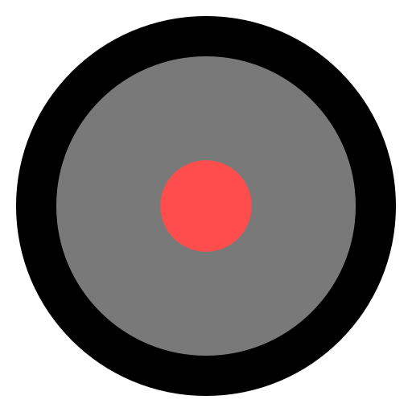

# DOING THUMBSTICK DEAD ZONES RIGHT

## NOT MINE
Previously from [here](www.third-helix.com/2013/04/12/doing-thumbstick-dead-zones-right.html) and [archived here](https://web.archive.org/web/20141025070920/https://www.third-helix.com/2013/04/12/doing-thumbstick-dead-zones-right.html)
**All images on this page have been recreated by me as vector files**

## Page
As OUYA Kickstarter backers begin receiving their dev units, I’ve seen several discussions pop up about thumbstick dead zones.
Unfortunately most of the advice I’ve seen is pretty bad, so I thought I’d share some simple techniques I’ve learned over the last six years 
working on major PS3 titles Warhawk and Starhawk.

(Note: The following code samples are in C# and based on Unity, but 
the basic principle should be clear enough to adapt to whatever 
language/API you’re working within.)

## What’s A Dead Zone?
Skip this section if you already know. For the rest of you, here’s a quick primer!

Analog thumbsticks typically send input to your code in the form of two numbers: one for the X (horizontal) axis, and one for the Y (vertical) axis.
Usually the number ranges from −1 (fully extended one direction) to +1 (fully extended the opposite direction), where 0 is dead-center. The assumption is that if you’re not touching the stick,
it’ll return (0, 0).

In reality, though, thumbsticks vary in quality and wear out over 
time. You’ve probably used a gamepad at some point that had a loose or 
“wiggly” stick; in that case, the neutral position is just a little bit 
off from (0, 0), even though you’re not touching the stick. To your 
code, that’s indistinguishable from the player pushing the stick just a 
tiny, tiny bit.

Dead zones are simply a minimum input threshold, often somewhere between 0.1 to 0.2.
If the input received from the stick is smaller than that, it’s ignored.

Have you ever played a game where the camera moved or rotated very 
slowly of its own accord, even though you weren’t touching the stick at 
all? That’s a case of a missing (or too-small) dead zone. (Curiously, I 
see this issue in a _lot_ of Xbox 360 first-person shooters.)

So to sum up: dead zones prevent unexpected input from loose thumbsticks, which makes players happy. :)

## The Naïve Way — Axial Dead Zone
Okay, let’s start with a look at the naïve implementation of a dead 
zone. This is the method everyone jumps to first, because it’s the most 
immediately intuitive:

```c#
	float deadzone = 0.25f;
	Vector2 stickInput = new Vector2(Input.GetAxis(“Horizontal”), Input.GetAxis(“Vertical”));
	if(Mathf.Abs(stickInput.x) < deadzone)
		stickInput.x = 0.0f;
	if(Mathf.Abs(stickInput.y) < deadzone)
		stickInput.y = 0.0f;
```

Simple enough: if our input magnitude in either direction is less 
than our dead zone, we simply zero out the input in that direction, and 
that’s all there is to it… right?

Well, here’s a diagram of what this kind of dead zone looks like. The circle represents rotation space of the thumbstick
(it’s the same as the circular opening in your controller that the stick is seated in), and the red shaded area represents
 where the dead zone will kick in and cancel out your input:
 


In practice, this implementation feels _very bad_, and you’ll 
notice it whenever you try to rotate the stick in a sweeping motion 
(which is a really common gesture in first-person shooters). What 
happens is, as you rotate the stick across one of the cardinal 
directions — anywhere within the red shaded area — you’ll feel it “snap”
 to the cardinal. If you’re making a game that’s all about 2D 
four-directional movement (maybe a _Bomberman_ clone or 
something) then that’s great, but for anything requiring analog 
precision (like a first-person or twin-stick shooter) this is nowhere 
near accurate enough.

## A Better Way — Radial Dead Zone
Fortunately it’s really easy to get rid of the cardinal-direction snap. We simply test the magnitude of the _entire input vector_, rather than testing each axis separately:

```c#
	float deadzone = 0.25f;
	Vector2 stickInput = new Vector2(Input.GetAxis(“Horizontal”), Input.GetAxis(“Vertical”));
	if(stickInput.magnitude < deadzone)
	stickInput = Vector2.zero;
```

This is _much_ better. For many games, you could probably ship
 with this; in fact, this method is the most common one I’ve seen people
 propose recently. Here’s what that dead zone looks like on the stick:
 


When we think about dead zones, this is usually the kind of thing  we’re envisioning:
 a very small area in the center of the stick within which input is ignored.
The size of the area is simply our best guess at how far a loose, worn-out stick is likely to wiggle on its own,
 without physical input.

## The High-Precision Problem
If you’re making a first- or third-person shooter, odds are you need all the input precision you can get.
 The previous method covers you for large movements, but you’ll find a flaw when you try to make very fine,
 low-magnitude adjustments (like aiming a sniper rifle). As you slowly push the stick away from neutral,
 you’ll feel the edge of the dead zone as your aim suddenly “kicks” into motion. This doesn’t feel smooth,
 and can make high-precision gameplay feel extremely tedious in a way that can be hard to define.

The problem with the previous method is that it’s clipping the input vector below the dead zone,
 which means all the precision that exists _inside_ the dead zone is completely lost. In other words,
 you can’t smoothly ramp your input from 0 to +1 any more; instead you snap from 0 to +0.2
 (or whatever your dead zone is), and _then_ you ramp from +0.2 to +1.
 
Here’s an illustration:


The gradient indicates the strength of the resulting input (after the dead zone is applied).
 Note that the edge of the dead zone is clearly visible: as you push the stick away from the center, the gradient value
 changes suddenly, not smoothly, at that edge.

## The Right Way — Scaled Radial Dead Zone
Fortunately, the high-precision problem is also very easy to fix. We just need to rescale the clipped input vector
 into the non-dead zone space:

```c#
	float deadzone = 0.25f;
	Vector2 stickInput = new Vector2(Input.GetAxis(“Horizontal”), Input.GetAxis(“Vertical”));
	if(stickInput.magnitude < deadzone)
		stickInput = Vector2.zero;
	else
		stickInput = stickInput.normalized * ((stickInput.magnitude - deadzone) / (1 - deadzone));
```

Here’s what the adjusted dead zone looks like:


Notice that there’s no longer a visible edge: as you push the stick away from the center,
 the gradient value changes smoothly while the dead zone is still preserved.
 This feels buttery-smooth, just as God intended. ;)

## Dead Zones For Fun and Profit
I called it the “right” way but that doesn’t mean you’ll never use any other method, ever.
 The most important thing is to use the method that makes sense for your particular project.
 Here are a few scenarios:

- **Tile-based (4-way) movement:** The Axial Dead Zone actually works well here since it snaps
 analog input to the only four input vectors that are actually relevant.
- **Twin-stick shooter:** In these games the magnitude of input rarely matters —
 all you care about is _direction_ — so the simple Radial Dead Zone should be perfectly suitable here.
- **Super-polished FPS:** Sometimes you need to sweep your aim through a line, and keep the crosshair on or close to the line.
 In this case you might want to blend a Scaled Radial with a modified Axial Dead Zone, such that the stronger your input in one axis,
 the larger the dead zone gets for the other axis. (At LightBox we called this the “bowtie” because the dead zone diagram looks like… a bowtie.
 I’ll leave the implementation of this one as an exercise for the reader!)

Now go forth and implement your dead zones properly! It’s easy, and your players will appreciate it. :)
_P.S. For what it’s worth, I’ve noticed that the OUYA controller seems to require a larger dead zone than
 the Xbox 360 controller. I had to go up as high as 0.25 to get a new, unworn OUYA controller to sit
 reliably at neutral, while a new, unworn Xbox 360 controller was fine around 0.1._
